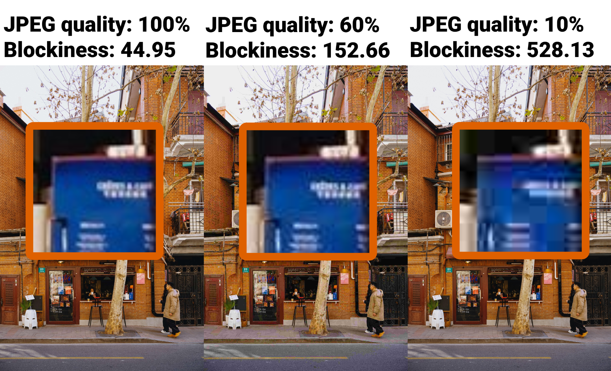
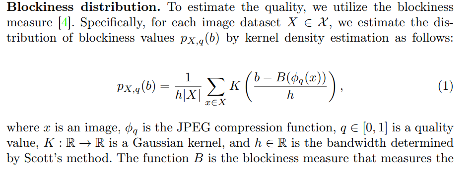
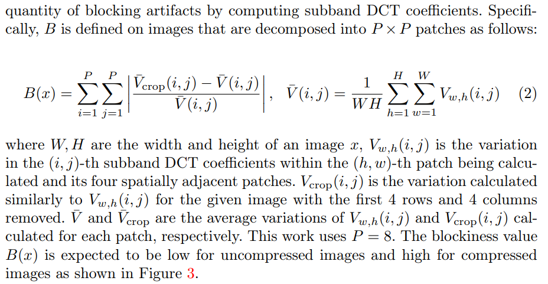
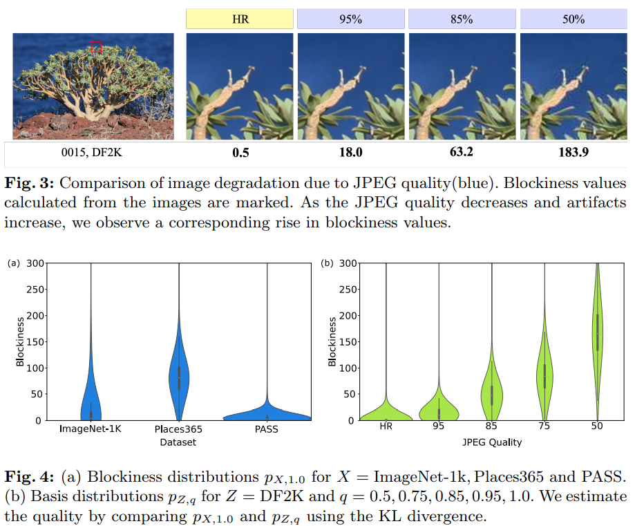

# Torch Image Blockiness Metric

The higher the blockiness metric value, the more likely it is that the image was JPEG-compressed at a low quality.

**Re-implementation of blockiness algorithm from the "Rethinking Image Super-Resolution from Training Data Perspectives" paper.**




This re-implementation has the following improvements over the original implenetation:

1. operations are written in torch (gpu friendly)
2. operations are vectorized
3. batch operation is support (with the assumption of same image size)


note: I think this method is scale-invariant as it computes the DCT for each fixed block rather than the entire image but I haven't empirically tested this yet.

note2: I was thinking about using the centarl crop of an image (most likely high entropy area) to reduce the compute time even more. The problem is that the crop might start in the middle of the JPEG block. I'm not sure if this method is robust to JPEG grid offsets. However, you could start cropping from the upper-left corner to some fixed dimension. Preferably, the bottom-right corner should pass through the center of the image.

## Usage

you can copy paste the [src/torch_blockiness.py](src/torch_blockiness.py) file to your project directory as it has no dependencies except torch and numpy.

```py
import torchvision
import torchvision.transforms.functional
from src.torch_blockiness import calculate_image_blockiness, rgb_to_grayscale

img = torchvision.io.read_image("example_images/unsplash.jpg")
img_gray = rgb_to_grayscale(img)
blockiness = calculate_image_blockiness(img_gray)
blockiness_float = float(blockiness)
```

## Motivation

Authors of the paper have demonstrated that filtering images which have JPEG compresson helps the super resolution model achieve better performance in the long run. 

## Definition from the paper





## References

"Rethinking Image Super-Resolution from Training Data Perspectives" (DiverSeg dataset), whose original implementation can be found at https://github.com/gohtanii/DiverSeg-dataset/tree/284cc1c030424b8b0f7040020bd6435e8ed2e6d7


```
@inproceedings{ohtani2024rethinking,
  title={Rethinking Image Super-Resolution from Training Data Perspectives},
  author={Ohtani, Go and Tadokoro, Ryu and Yamada, Ryosuke and Asano, Yuki M and Laina, Iro and Rupprecht, Christian and Inoue, Nakamasa and Yokota, Rio and Kataoka, Hirokatsu and Aoki, Yoshimitsu},
  booktitle={European Conference on Computer Vision},
  pages={19--36},
  year={2024},
  organization={Springer}
}
```

--- 

"A JPEG blocking artifact detector for image forensics", original paper which introduced blockiness metric.

https://www.sciencedirect.com/science/article/abs/pii/S0923596518302066 (open it with sci-hub)

```
@article{bhardwaj2018jpeg,
  title={A JPEG blocking artifact detector for image forensics},
  author={Bhardwaj, Dinesh and Pankajakshan, Vinod},
  journal={Signal Processing: Image Communication},
  volume={68},
  pages={155--161},
  year={2018},
  publisher={Elsevier}
}
```